# BTCQuest

BTCQuest is a learning platform that uses blockchain technology for a secure educational experience. Token gating ensures only authorized users access content, and students can earn STX, BTC and NFTs to unlock more. An escrow contract handles transactions and ensures funds are secure. BTCQuest is a community that connects students with peers and educators to collaborate and learn together.

## Development server

Before starting the application, first create a database in mongo named "quizzards"
 
To start the Server :
 

1. `cd server` 
2. `node index.js`
    

To run the application on the browser:  

3. Open a new terminal and run cd client/quizzards_client 
4. ` ng serve ` or ` npm start `  
5. Navigate to `http://localhost:4200/`.

## Features

<!-- 1. Used JWT for login -->
1.user can login
2. The user can play a quiz only once
3. On submitting a quiz, the user is redirected to the feedback page. Here the student cannot redirect back to the Quiz.
4. Chatbot is provided, so new users can easily navigate through the appication
5. Teachers can get an overview of student's performances with the help of charts.

<!-- Landing Page

Registration Page :
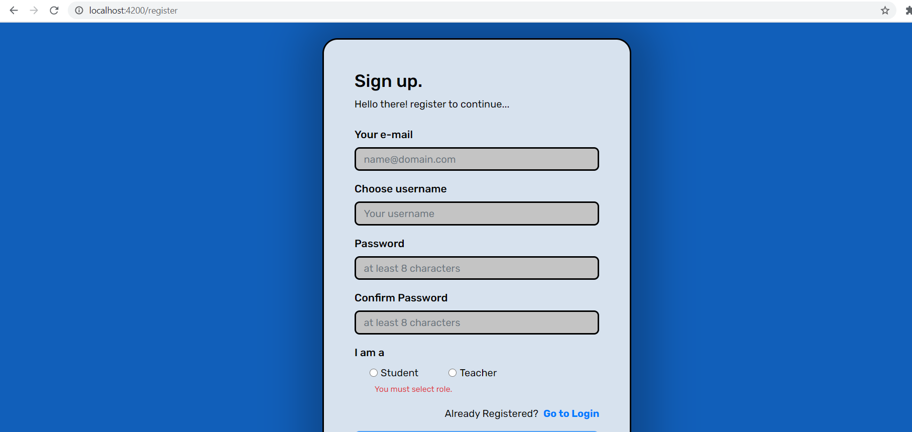

Login Page :
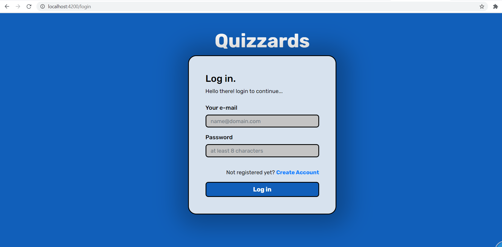

ChatBot
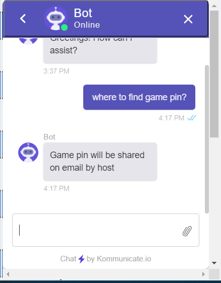

 
Teachers Side:
 

Dashboard Page
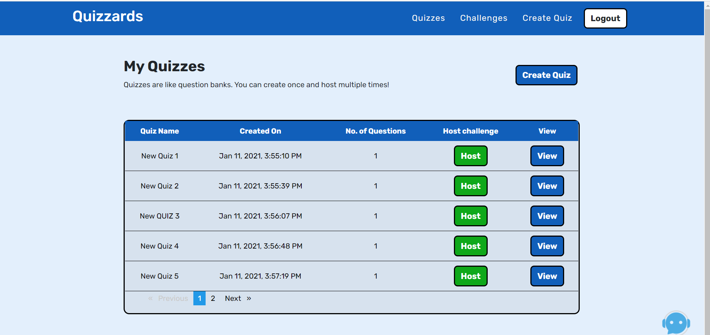

Create Quiz
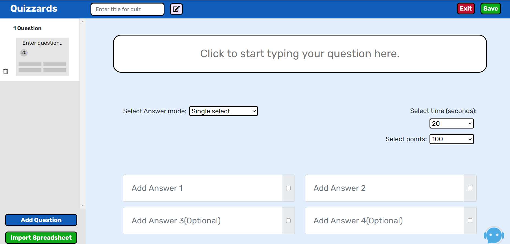

Challenge List
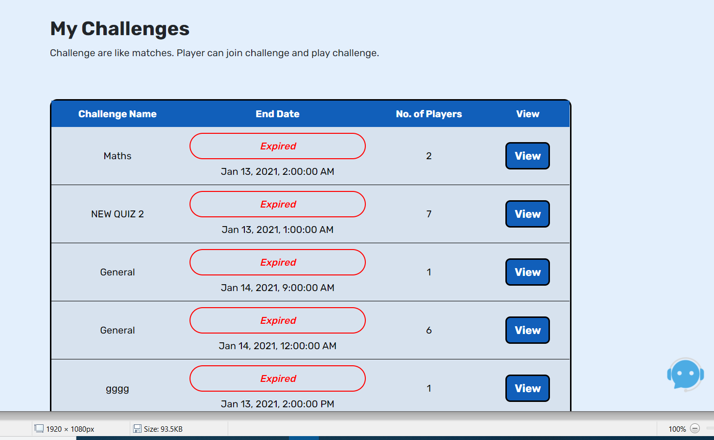

View Feedback recived by Students
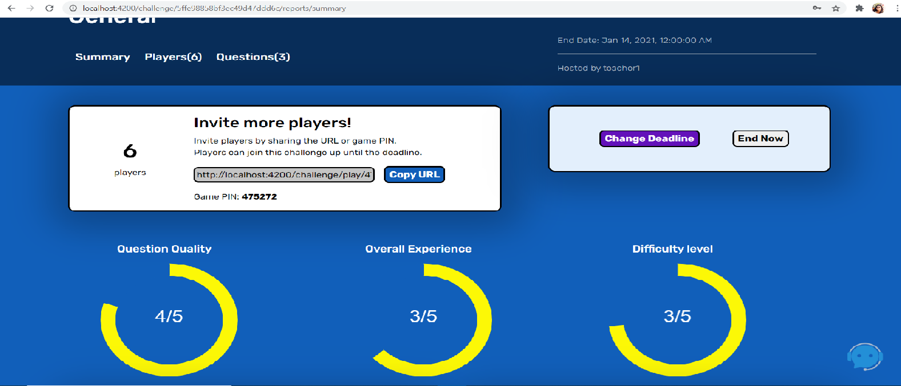

View students performances via Charts
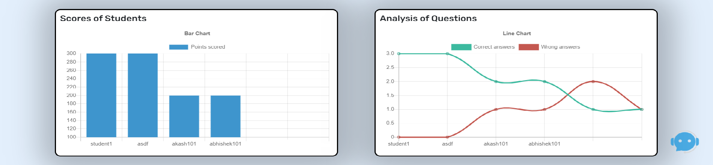

 
Student Side:
 

Dashboard Page
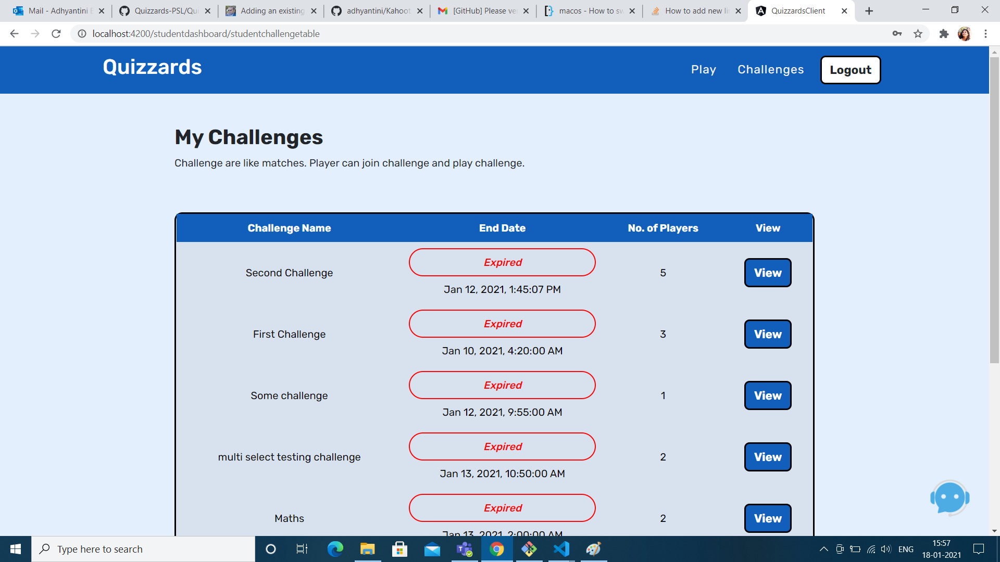

View report of challenge
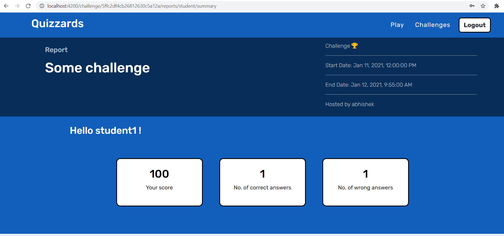

Join Game
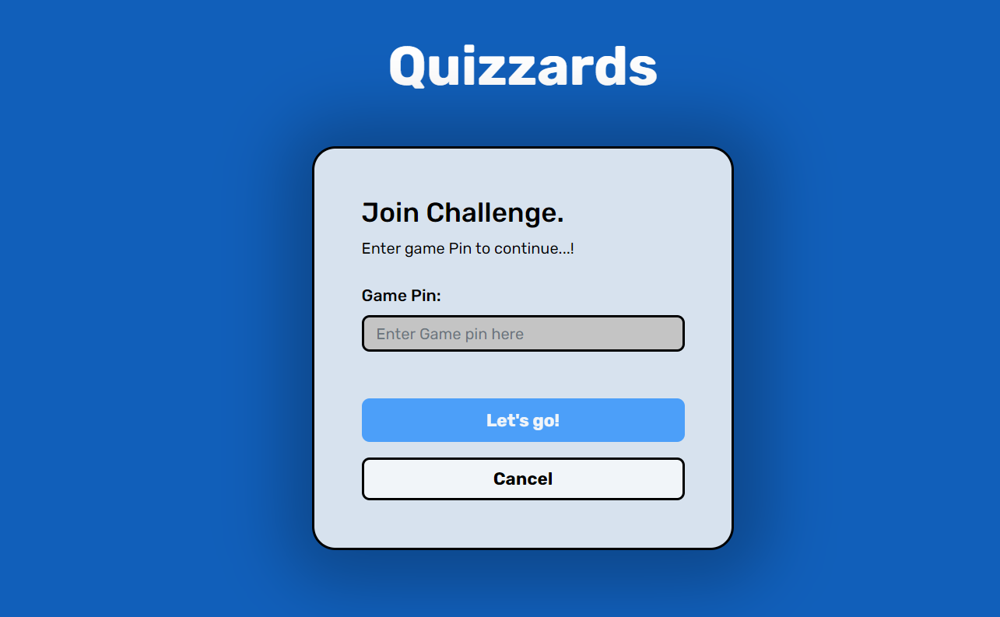 -->

